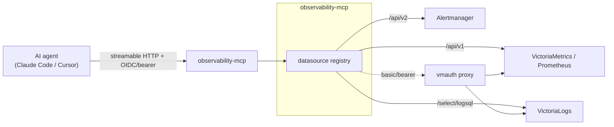
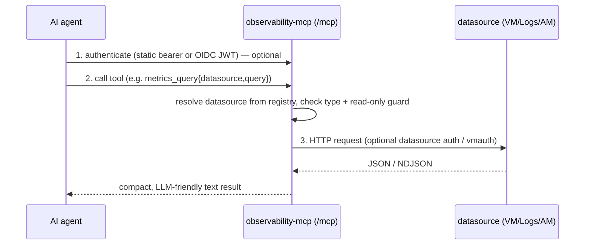

# observability-mcp-server

An **MCP (Model Context Protocol) server** that lets an AI agent (Claude Code / Cursor) query
your observability stack — **VictoriaMetrics**, **VictoriaLogs**, **Prometheus** and
**Alertmanager** — through one uniform, instrumented tool surface. Which datasources are
available is entirely configuration-driven, and each can be reached directly **or through a
`vmauth` proxy** (with optional basic/bearer auth and custom CA).

It is the observability sibling of [`kubernetes-mcp`](https://github.com/truepace-io-oss/kubernetes-mcp-server):
same agent-authentication model (static bearer tokens + Authentik/Keycloak OIDC), same Prometheus
self-metrics + Grafana dashboard, same Helm chart / CI / GitOps deployment conventions.

## Datasource compatibility

| Backend | Status | Notes |
|---|---|---|
| VictoriaMetrics (single & cluster `vmselect`) | ✅ Supported | Prometheus `/api/v1/*` query API; direct or via `vmauth`. Cluster mode uses `pathPrefix: /select/0/prometheus`. |
| Prometheus | ✅ Supported | Prometheus-compatible `/api/v1/*`. |
| VictoriaLogs (single & cluster `vlselect`) | ✅ Supported | LogsQL via `/select/logsql/*`; direct or via `vmauth`. |
| Alertmanager (incl. `vmalertmanager`) | ✅ Supported | v2 API; read + silence create/delete (writes are read-only-gated). |
| Grafana (dashboards / query proxy) | 🔜 Planned | — |
| Loki | 🔜 Planned | LogQL — candidate `loki` datasource type. |
| Thanos / Cortex / Mimir | 🔜 Planned | Prometheus-API-compatible; likely works as `prometheus` today. |
| Jaeger / Tempo (traces) | 🔜 Considered | separate tool group. |

See [`docs/datasources.md`](docs/datasources.md) for how to add & configure a datasource, and how to add a **new datasource type**.

## Topology



## Request flow



Two independent gates: **agent → MCP** auth (who may call the MCP) and **MCP → datasource**
auth (how the MCP reaches a backend). They are configured separately.

## Tools

| Group | Tools |
|---|---|
| Common | `datasources_list` |
| Metrics (`victoriametrics`/`prometheus`) | `metrics_query`, `metrics_query_range`, `metrics_series`, `metrics_labels`, `metrics_label_values`, `metrics_metadata`, `rules_list`, `alerts_active`, `targets_list` |
| Logs (`victorialogs`) | `logs_query`, `logs_hits`, `logs_stats`, `logs_field_names`, `logs_field_values`, `logs_streams` |
| Alertmanager | `alertmanager_alerts`, `alertmanager_alert_groups`, `alertmanager_silences_list`, `alertmanager_silence_get`, `alertmanager_status`, `alertmanager_receivers`, **(write)** `alertmanager_silence_create`, `alertmanager_silence_delete` |

Every tool takes an optional `datasource` argument (defaults to the configured default). Write
tools are blocked when the instance (`readOnly: true`) or the target datasource (`readOnly: true`)
is read-only.

## Quick start

```bash
cat > /tmp/omcp.yaml <<'EOF'
defaultDatasource: vm
datasources:
  - name: vm
    type: victoriametrics
    url: http://localhost:8428          # single-node VM; add pathPrefix for cluster
  - name: logs
    type: victorialogs
    url: http://localhost:9428
EOF
go run . --config /tmp/omcp.yaml
# MCP on :9090/mcp, self-metrics on :9091/metrics
```

See [`examples/config.yaml`](examples/config.yaml) for a full example (all types, vmauth, auth).

## Configure an agent

```bash
claude mcp add --transport http observability https://observability-mcp.tools.averion.zone/mcp
```
For OIDC via Authentik you must supply the `client_id` and auth-server metadata URL — see
[`examples/mcp.claude.json`](examples/mcp.claude.json), [`examples/mcp.cursor.json`](examples/mcp.cursor.json),
and [`docs/auth.md`](docs/auth.md).

## Deploy (Helm + ESO)

```bash
helm install obs deploy/helm/observability-mcp -n observability-mcp --create-namespace \
  --set 'datasources[0].name=vm' \
  --set 'datasources[0].type=victoriametrics' \
  --set 'datasources[0].url=http://vmselect-...:8481' \
  --set 'datasources[0].pathPrefix=/select/0/prometheus' \
  --set config.defaultDatasource=vm
```
Production deployment through the `environments` GitOps repo (Authentik OIDC, ESO/Bitwarden,
ingress) is documented in [`docs/environments-integration.md`](docs/environments-integration.md).

## Security model

- **Agent auth** (optional, pluggable): static bearer tokens and/or OIDC (Authentik/Keycloak). Always run behind TLS when enabled.
- **Datasource auth** (optional, per datasource): basic or bearer, plus custom CA / `insecureSkipTLSVerify` — this is what a `vmauth` proxy needs.
- **Read-only guard**: a global `readOnly` kill-switch and per-datasource `readOnly` block the Alertmanager write tools (defense-in-depth on top of the backend's own auth).
- Agent auth ≠ datasource auth: authenticating a caller to the MCP does not change what the MCP can do against a backend.

## Metrics

Prometheus self-metrics are served on a separate, unauthenticated port (`:9091` by default):
per-tool usage/latency/results, agent-auth outcomes, outbound datasource requests (with status
codes) + latency, and datasource reachability. A ServiceMonitor and Grafana dashboard ship with
the chart. See [`docs/metrics.md`](docs/metrics.md).

## Testing

```bash
make test        # unit tests (httptest fakes; no real backend needed)
make test-e2e    # full MCP server over HTTP against fake VM/Logs/AM backends
make lint        # go vet + gofmt
```

## Development

Go 1.25+, the [MCP Go SDK](https://github.com/modelcontextprotocol/go-sdk), and stdlib HTTP.
Packages: `internal/config`, `internal/datasources`, `internal/promapi`, `internal/logsql`,
`internal/alertmanager`, `internal/mcpserver`, `internal/auth`, `internal/metrics`. See
[`docs/architecture.md`](docs/architecture.md).
