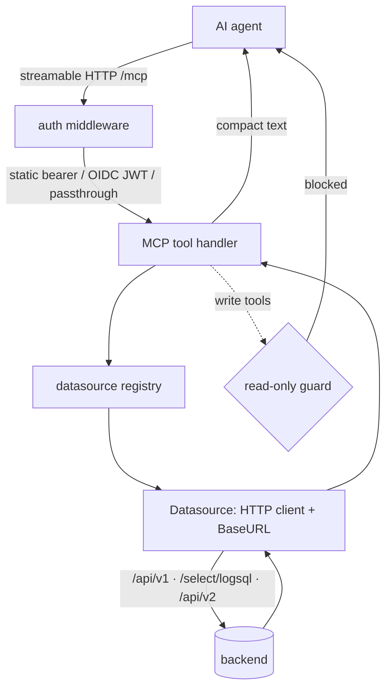
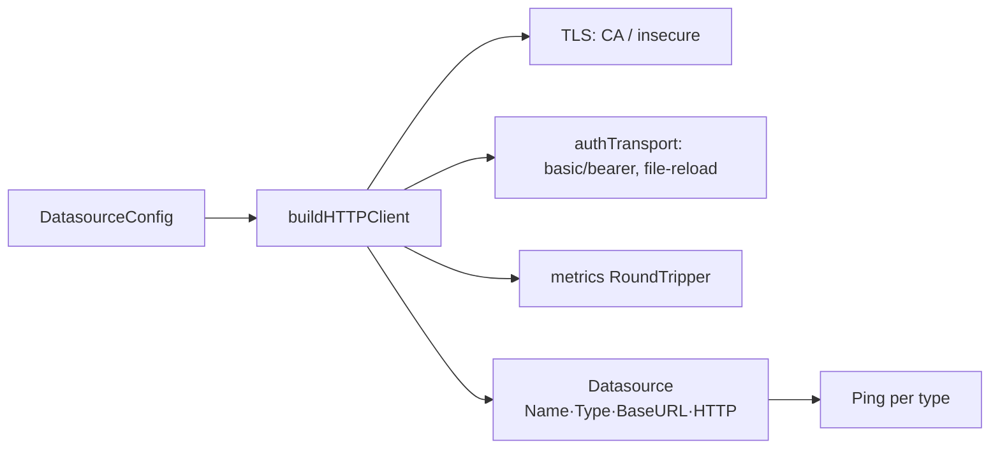
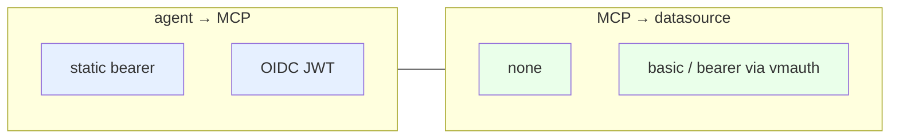
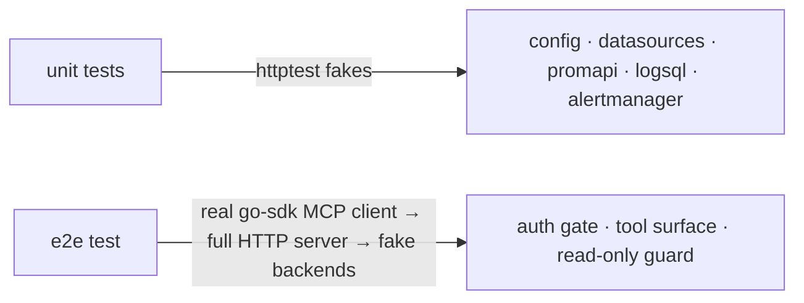

# Architecture

`observability-mcp` exposes observability backends to an AI agent as MCP tools. It holds no
policy of its own beyond an optional agent-auth layer and a read-only guard; every query is a
plain HTTP request to a configured datasource.

## Request flow

## Packages

| Package | Responsibility |
|---|---|
| `internal/config` | Load/validate `config.yaml` + `OMCP_*` env overrides. Datasource + agent-auth schema. |
| `internal/datasources` | Registry of datasources; per-datasource HTTP client (TLS/CA, basic/bearer auth, outbound-metrics RoundTripper, timeout); `Ping` reachability. |
| `internal/promapi` | Prometheus/VictoriaMetrics `/api/v1/*` query client. |
| `internal/logsql` | VictoriaLogs `/select/logsql/*` (LogsQL) client, NDJSON streaming with a hard line cap. |
| `internal/alertmanager` | Alertmanager v2 `/api/v2/*` client (alerts, silences, status, receivers). |
| `internal/mcpserver` | Tool registration (generic instrumented `addTool`), datasource resolution, type/read-only guards, result formatting. |
| `internal/auth` | Agent → MCP authentication: static bearer tokens and OIDC (OAuth 2.1 resource server). |
| `internal/metrics` | Prometheus self-metrics + the outbound-HTTP RoundTripper. |
| `main.go` | Wire everything; serve `/mcp` (auth), `/healthz`, `/readyz`, metrics on a separate port; periodic reachability probe; graceful shutdown. |

## Datasource abstraction

- `BaseURL = url + pathPrefix` (no trailing slash). Cluster VM uses `pathPrefix: /select/0/prometheus`.
- Datasource-side auth (basic/bearer) is injected by a RoundTripper that re-reads file-backed
  credentials on every request, so ESO/projected rotation is picked up without a restart.
- A metrics RoundTripper records `omcp_datasource_requests_total` / `..._duration_seconds` for
  every outbound call.

## Authentication (two independent layers)

Layer 1 decides **who may call the MCP** (see [auth.md](auth.md)). Layer 2 decides **how the MCP
reaches a backend** (see [datasources.md](datasources.md)). Neither implies the other.

## Testing strategy

- **Unit** (`internal/...`): config validation, registry, and each backend client against `httptest` servers.
- **E2E** (`test/e2e`): boots the full `/mcp` server with static-token auth against fake VM/Logs/AM
  backends and drives it with a real MCP client — verifying the tool surface, query paths, the
  read-only guard, and that unauthenticated calls are rejected.
