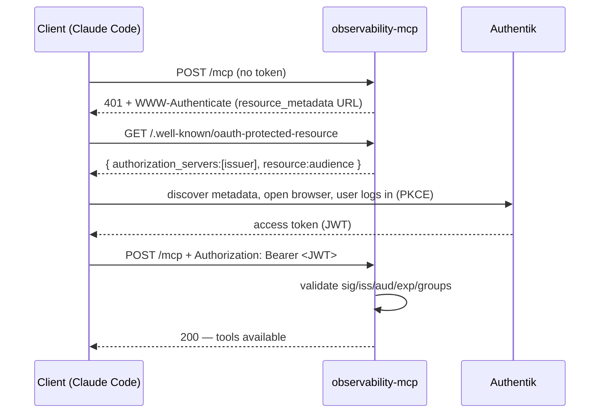

# Agent authentication

This secures the **agent → MCP** link. It is independent of datasource auth (how the MCP reaches
a backend — see [datasources.md](datasources.md)). Two modes, usable separately or together:

| Mode | Use for | Browser login? |
|---|---|---|
| Static bearer tokens | machines / CI / break-glass | never |
| OIDC (Authentik / Keycloak) | humans | yes — once, then silent refresh |
| Both | machines + humans | only for OIDC |

> ⚠️ Bearer tokens over plaintext are insecure. When auth is enabled, always run behind TLS
> (an OIDC-gated public ingress or an internal ingress). Auth is **disabled by default**; when
> disabled, protect the transport at the ingress instead.

## Mode 1 — static bearer tokens

The agent sends `Authorization: Bearer <token>`. Tokens are configured with an inline value
(discouraged) or a `tokenFile` (preferred; re-read per request, so ESO/projected rotation is
instant). In Helm each token's secret is provided via ESO and mounted at `/etc/omcp/auth/<name>/token`.

```yaml
auth:
  enabled: true
  static:
    enabled: true
    tokens:
      - name: ci
        tokenFile: /etc/omcp/auth/ci/token
```

Client config:
```json
{ "mcpServers": { "observability": {
  "type": "http",
  "url": "https://observability-mcp.example.com/mcp",
  "headers": { "Authorization": "Bearer ${OBS_MCP_TOKEN}" }
}}}
```

## Mode 2 — OIDC (Authentik / Keycloak)

The MCP acts as an OAuth 2.1 **resource server**: it validates JWT access tokens (signature via
the provider's JWKS, plus issuer, audience, expiry) and optionally enforces required scopes/groups.
No secret is needed (JWKS is public). It advertises protected-resource metadata at
`/.well-known/oauth-protected-resource` so compliant clients can discover the provider and log in.

```yaml
auth:
  enabled: true
  oidc:
    enabled: true
    issuer: "https://auth.tools.averion.zone/application/o/observability-mcp/"
    audience: "observability-mcp"      # == Authentik client_id == token aud
    groupsClaim: "groups"
    usernameClaim: "preferred_username"
    requiredGroups: []                  # e.g. ["observability-mcp-users"]
    resourceMetadata: true
```

### Browser login flow (first use only)



### Provider setup — Authentik (no Dynamic Client Registration)

Create an OAuth2/OpenID **Provider** + **Application** (slug `observability-mcp`). Set
`include_claims_in_access_token: true`; `client_id` = `observability-mcp` (= the MCP `audience`);
add the `groups` scope mapping if you use `requiredGroups`; register the localhost redirect URIs
(`http://localhost:\d+/.*`, `http://127.0.0.1:\d+/.*`). In this repo the provider is created by the
Authentik blueprint — see [environments-integration.md](environments-integration.md).

Because Authentik has no DCR, the client must be told the `client_id` **and** the auth-server
metadata URL:
```json
{ "mcpServers": { "observability": {
  "type": "http",
  "url": "https://observability-mcp.tools.averion.zone/mcp",
  "oauth": {
    "clientId": "observability-mcp",
    "authServerMetadataUrl": "https://auth.tools.averion.zone/application/o/observability-mcp/.well-known/openid-configuration"
  }
}}}
```
Then `claude mcp login observability` (log in as an `observability-mcp-users` member).

### Provider setup — Keycloak (has DCR)

Create a public PKCE client, add an **audience mapper** (`aud = <MCP audience>`) and a `groups`
mapper. With DCR the client self-registers, so only the URL is needed in the agent config.

## Both at once

Enable `static` and `oidc` together: machines present a static token, humans get the browser flow.
A request is accepted if **either** verifier accepts it. The `omcp_auth_requests_total` metric
records which method (static|oidc|none) allowed/denied each request.
