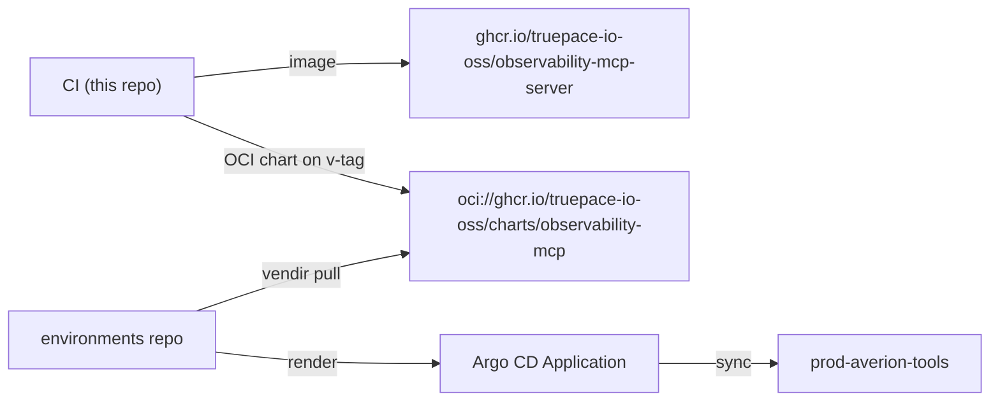

# Deploying via the `environments` GitOps repo

Production deployment goes through the `environments` repo (myks + ytt + Helm + Argo CD), exactly
like `kubernetes-mcp`. The image and OCI Helm chart are published by this repo's CI; `environments`
pins their versions and Argo CD syncs the result.



## Files to add in `environments`

```
prototypes/observability-mcp/
  app-data.ytt.yaml                 # schema + defaults (image, oidc, datasources, ...)
  vendir/vendir-data.ytt.yaml       # OCI chart name/url/version (alphabetical keys — renovate!)
  vendir/base.yaml                  # vendir Config pulling the chart
  helm/observability-mcp.yaml       # ytt-templated Helm values
prototypes/authentik/ytt/observability-mcp-blueprint-secret.yaml   # Authentik OIDC blueprint
envs/env-data.ytt.yaml             # add authentikBlueprints.observabilityMcp defaults
envs/prod-averion-tools/env-data.ytt.yaml          # enable the app + the blueprint
envs/prod-averion-tools/_apps/observability-mcp/app-data.ytt.yaml  # per-env overrides
docs/observability-mcp.md          # user-facing "how to connect" doc
```

## Steps

1. **Prototype** — model on `prototypes/kubernetes-mcp/`. `app-data.ytt.yaml` declares
   `application.observabilityMcp` (namespace, image repo + `#! renovate: datasource=docker` tag,
   `serviceMonitor`, `grafanaDashboard`, `dashboardFolder`, `ingressHost`, `oidc.{issuer,audience,requiredGroups}`,
   and a `datasources` list with Bitwarden UUIDs for any basic/bearer/CA material).
2. **Chart pin** — `vendir/vendir-data.ytt.yaml` sets `observabilityMcpChart:{name: observability-mcp,
   url: oci://ghcr.io/truepace-io-oss/charts, version: <x.y.z>}` with keys in **alphabetical order**
   (renovate requirement). `vendir/base.yaml` pulls it (copy the blueprint, swap the data ref).
3. **Helm values** — `helm/observability-mcp.yaml` maps env data → chart values: image, `config.defaultDatasource`,
   `auth.oidc` (enabled, issuer/audience/requiredGroups/groupsClaim/usernameClaim/resourceMetadata),
   `externalSecrets` (enabled when any datasource needs a secret), the `datasources` loop (Bitwarden
   UUIDs → `auth.basic.esoRef`/`auth.bearer.esoRef`/`tls.caEsoRef`), `ingress` (enabled, `className: nginx`,
   host, TLS), `podSecurityContext` (nonroot 65532), `serviceMonitor`, `grafanaDashboard`
   (`folderAnnotation: grafana-folder` for this stack's sidecar), `service`.
4. **Authentik blueprint** — copy `prototypes/authentik/ytt/kubernetes-mcp-blueprint-secret.yaml`,
   rename to group `observability-mcp-users`, app/provider/client_id `observability-mcp`. Guard on
   `authentikBlueprints.observabilityMcp.enabled`. Add its secret name to `blueprints.secrets` in
   `prototypes/authentik/helm/authentik.yaml` under the same guard. Add defaults to
   `envs/env-data.ytt.yaml` (`authentikBlueprints.observabilityMcp:{enabled:false, clientId,
   applicationSlug, groupName, signingKeyName}`).
5. **Enable in prod** — in `envs/prod-averion-tools/env-data.ytt.yaml` add `- proto: observability-mcp`
   to `environment.applications` and `observabilityMcp: { enabled: true }` under `authentikBlueprints`.
6. **Per-env overrides** — `envs/prod-averion-tools/_apps/observability-mcp/app-data.ytt.yaml`: ingress
   host `observability-mcp.tools.averion.zone`, `serviceMonitor:true`, `grafanaDashboard:true`,
   `dashboardFolder:"MCP Servers"`, the Authentik issuer/audience, and the datasources (VM/Logs/AM
   in-cluster Services — see [datasources.md](datasources.md); start all `readOnly: true`).
7. **Render & commit** — `myks render ALL` (never a single app), commit the sources and the rendered
   `rendered/argocd/prod-averion-tools/app-observability-mcp.yaml` +
   `rendered/envs/prod-averion-tools/observability-mcp/**`. Argo CD syncs automatically.

## First deploy ordering

The chart/image versions must exist in GHCR **before** `environments` pins them:

1. Merge to `main` → CI publishes the image (`sha-…`, `latest`).
2. Tag `vX.Y.Z` → CI publishes the semver image **and** the OCI chart `observability-mcp:X.Y.Z`.
3. Set the prototype chart `version` + app image `tag` to that version, `myks render ALL`, commit.
4. Argo CD syncs; add yourself to the Authentik `observability-mcp-users` group and
   `claude mcp login observability`.
